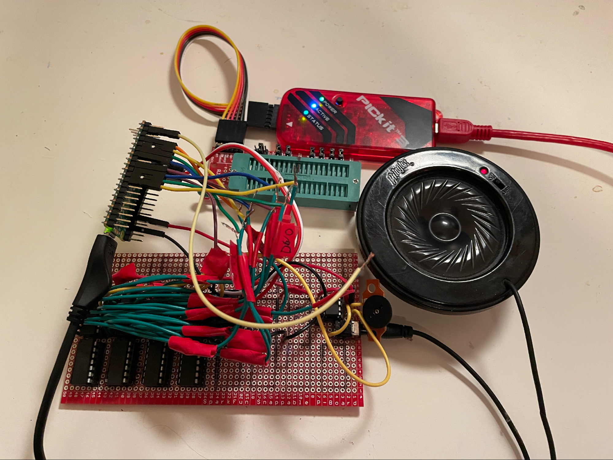
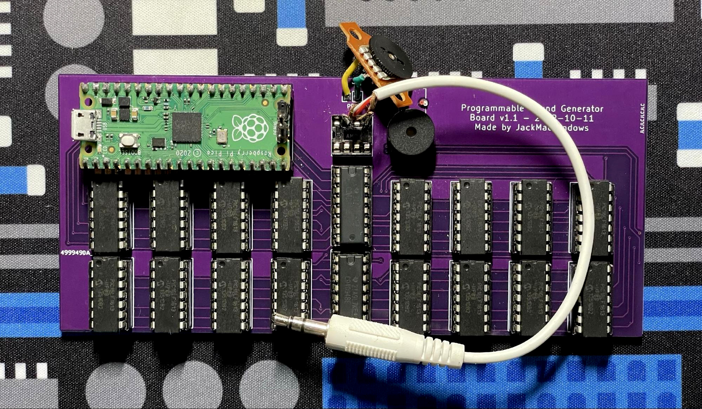

# JackMacWindows's Programmable Sound Generator
This repo contains the source code for my programmable sound generation board. [Read the article for more info.](https://mcjack123.github.io/PSG/)

## Contents
* `PSG-PCB` is a KiCad PCB layout for the complete 16-channel board.
* `PSG.X` contains an MPLAB X project with the wave generator code for the microcontrollers.
* `pico-sound-driver` contains a Raspberry Pi Pico project for managing the MCUs with a USB MIDI interface.
* `sound-midi.cpp` is a CraftOS-PC plugin for connecting to the board using the `sound` plugin interface.
* `programmer.cpp` is a program to quickly flash UF2, HEX, or BIN (concatenated HEX + UF2) firmware files to the PIC chips and the Pico. The current production firmware is available in `firmware.bin`.
* `instrument-designer.html` is a small HTML+JS app to quickly design and upload instrument patches to the board.

## Documentation

### Mono/Poly Mode
The board has two different modes available. These modes are controlled by the standard CCs 126 and 127.

In mono mode, each channel can play one frequency and has its own global program and volume settings. This has a 1:1 correlation with each chip - one MIDI channel controls its corresponding chip number. Instruments are not available in this mode - instead, the program number (from 0-7, looping after) controls the wave type directly, as if the instrument bank was just initialized.

In poly mode, chips are allocated as needed for each note to play. Programs are assigned to each channel, and instruments are available.

### Direct Parameter Control
To support being able to directly control the parameters of each chip, some CCs are added to control the frequency instead of requiring note+pitch bend messages. See below for more information on those. In addition, when in mono mode, the standard volume and program change settings will directly affect the chips.

### Stereo Support
Firmware version 1.2.0 adds support for stereo output on board revisions that support it (v1.2.0 or later). There are three modes available: center (default), split stereo, and full stereo. In split stereo mode, all 16 voices are available, but the first eight will go straight to the left side, and the second eight will go to the right side. This is most effective when in mono note mode. Full stereo reduces the number of available voices to 8, but plays notes with chips on both sides, making them audible on both sides, as well as enabling panning using the CC & envelope.

### Instruments
Instruments allow attaching envelopes to waves for continuous changes to certain parameters. Four envelopes are available for controlling volume, panning, frequency adjustment, and duty cycle (square waves only). Instruments replace basic wave type controls in poly mode, and all 128 programs in MIDI have instruments attached.

Envelopes are based on the XM module format's envelope design. Each envelope has a maximum of 12 points available, each storing 16-bit pairs of X/Y coordinates. The X axis indicates the time of the point, in hundredths of a second. The Y axis stores the MIDI value of the control for everything except frequency. The frequency envelope's Y axis is the number of 16ths of a semitone to offset the note by, with a value of `0x8000` being centered at ±0.

Each envelope also has the ability to loop between certain points. There are three modes: one shot, which plays the envelope straight and ends at the last point, regardless of note off; sustain, which holds the envelope position at the *sustain point* until the note is released; and loop, which jumps the position in the envelope back to the loop start point when it reaches the loop end point. (Sustain mode functions like loop mode as if the start and end point were the same.)

By default, the instrument list is filled with basic instruments with no envelopes. The wave types cycle in the same order as mono mode, but program numbers divisible by 8 hold square waves with increasing default duty levels (for example, program 8 is a 1/16 duty square wave, program 32 is a 1/4 duty square wave, etc.). Program 0 is also set to a 1/2 duty square wave, as a duty of 0 is invalid.

### CC List
This table lists all available CCs.

| CC  | Description |
|-----|-------------|
| 1   | Square wave duty cycle |
| 7   | Volume |
| 10  | Pan (full stereo mode only) |
| 24  | Frequency (MSB) |
| 56  | Frequency (LSB) |
| 86  | Stereo mode: `0x40` -> stereo enable bit, `0x20` -> dual channel bit |
| 123 | All notes off |
| 126 | Mono mode |
| 127 | Poly mode |

### Wave Types
| Code | Wave |
|------|------|
| 0    | None, or square |
| 1    | Sine |
| 2    | Triangle |
| 3    | Saw (ascending) |
| 4    | Saw (descending) |
| 5    | Square |
| 6    | Noise  |
| 7    | Undefined |

### SysEx List
PSG accepts SysEx commands with vendor ID `00 46 71`. Commands are followed by two bytes for the command number in little endian.

| Command | Data | Description |
|---------|------|-------------|
| `00 00` | HEX file | Flash PIC firmware to all attached chips |
| `01 F7` | None | Enter UF2 bootloader mode |
| `02 00` | Patch number, instrument data | Upload instrument data to program slot |

#### Instrument data
Instruments are stored in a 212-byte binary block encoded with Base64. Point coordinates are in little endian.

| Offset | Size | Description |
|--------|------|-------------|
| `0x00` | 2    | X coordinate of first point in volume envelope |
| `0x02` | 2    | Y coordinate of first point in volume envelope |
| `0x04` | 2/2  | X/Y coordinates of second point in volume envelope |
| `0x08` | 40   | ...10 more points |
| `0x30` | 1    | Number of points in volume envelope |
| `0x31` | 1    | Sustain point number in volume envelope (`0xFF` = no sustain) |
| `0x32` | 1    | Loop start point number in volume envelope (`0xFF` = no loop) |
| `0x33` | 1    | Loop end point number in volume envelope (`0xFF` = no loop) |
| `0x34` | 52   | Pan envelope |
| `0x68` | 52   | Frequency envelope |
| `0x9C` | 52   | Duty envelope |
| `0xD0` | 1    | Wave type |
| `0xD1` | 3    | Reserved, set to 0 |
